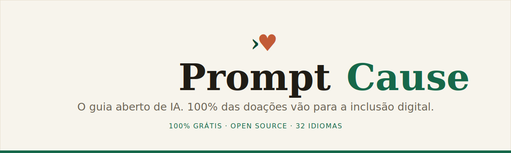

<div align="center">



<br>

**The open, free guide to AI — and every donation goes 100% to digital inclusion.**

[](LICENSE)
[](LICENSE)
[](CONTRIBUTING.md)
[](#-translation-i18n)
[](https://promptcause.com)

[**Website**](https://promptcause.com) · [Learn](https://promptcause.com/en/aprender) · [Skills](https://promptcause.com/en/skills) · [The Cause](https://promptcause.com/en/causa) · [Contribute](#-contributing)

</div>

---

## What it is

**PromptCause** is an **open and free** guide to artificial intelligence — from your first prompt to advanced engineering — in **32 languages**. The content is free forever. People who learn from it and want to give back find a list of **digital-inclusion NGOs** on the site: pick one and donate. **100% goes straight to the NGO** — the platform never custodies or keeps a cent.

> **Radical transparency:** the money never passes through us. Donations go straight to the institution's account.

## ✨ Highlights

- 📚 **Prompt engineering guide** — 38 techniques, each with the right and wrong way side by side.
- 🌍 **32 languages** with automatic fallback (next-intl).
- 🧩 **Skills marketplace** — an open catalog of skills for Claude Code, Copilot, Cursor and more (`sha`-pinned).
- 💚 **Donations passed on 100%** — partner NGOs with a direct button and a public ledger.
- 🤝 **Open source** — content, skills and code built by the community.
- 👥 **Contributors page** — visibility for everyone who builds it.

## 🧱 Stack

| Layer | Tech |
|---|---|
| Framework | Next.js 16 (App Router) |
| Database | Postgres (Neon) + Prisma |
| i18n | next-intl (32 languages) |
| UI | Tailwind CSS v4 + shadcn/ui |
| Hosting | Vercel |

## 🚀 Running locally

```bash
git clone https://github.com/PhAlves23/promptcause.git
cd promptcause
npm install

cp .env.example .env          # set DATABASE_URL, ADMIN_PASSWORD, SESSION_SECRET
npx prisma generate
npx prisma db push            # create the tables
node prisma/seed.mjs          # sample NGOs (optional)

npm run dev                   # http://localhost:3000
```

> You'll need a Postgres database. [Neon](https://neon.tech) has a free tier that works out of the box with Vercel.

## 🗂️ Structure

```
app/[locale]/         pages (home, learn, skills, cause, donate, contributors)
app/api/webhooks/     donation webhook ingestion (per NGO gateway)
app/admin/            operator panel (login + NGO management + entries)
components/           UI (donation widgets, skills, media, header…)
content/biblia/       guide content, one JSON per language
lib/                  donations, skills, contributors, biblia, db, auth
messages/             UI translations, one JSON per language
prisma/               schema + seed
scripts/translate.mjs AI translation pipeline
```

## 🌍 Translation (i18n)

The UI ships in **32 languages** (PT/EN/ES reviewed; the rest via fallback). To translate a namespace with AI:

```bash
ANTHROPIC_API_KEY=sk-... npm run translate <namespace>
```

## 🤝 Contributing

Every contribution is welcome — and earns a spot on the [contributors page](https://promptcause.com/en/contribuidores).

- **Content** — grab a task from [`help wanted` issues](https://github.com/PhAlves23/promptcause/issues?q=is%3Aopen+label%3A%22help+wanted%22) (RAG, MCP, Fine-tuning, Agents, Evals, Embeddings…).
- **Skills** — publish a skill in the [marketplace](https://github.com/PhAlves23/prompt-cause-marketplace).
- **Code / translation** — open a PR.

Read [CONTRIBUTING.md](CONTRIBUTING.md). Sensitive areas (payments, admin, infra) go through maintainer review (`CODEOWNERS`).

## 💚 The cause

Knowing how to use AI has become literacy — and literacy isn't for sale. So the knowledge stays open, and those who can give back fund digital inclusion for people not yet even online.

## 📄 License

- **Code:** [MIT](LICENSE)
- **Content** (guide, texts): **CC BY-SA 4.0** — use it, translate it, share it.
